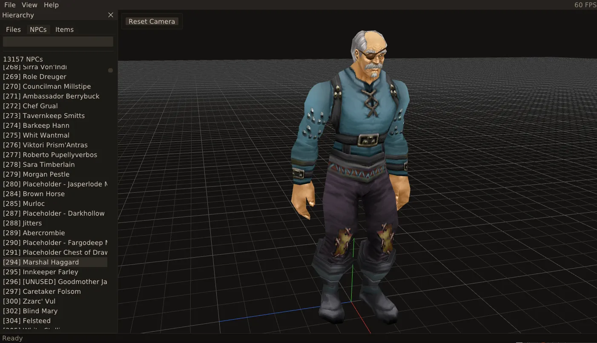
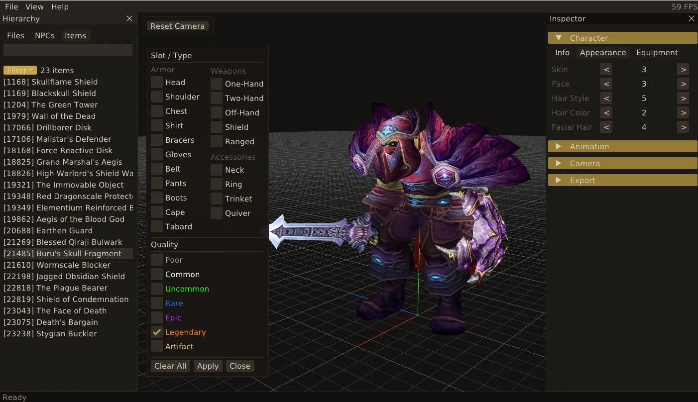
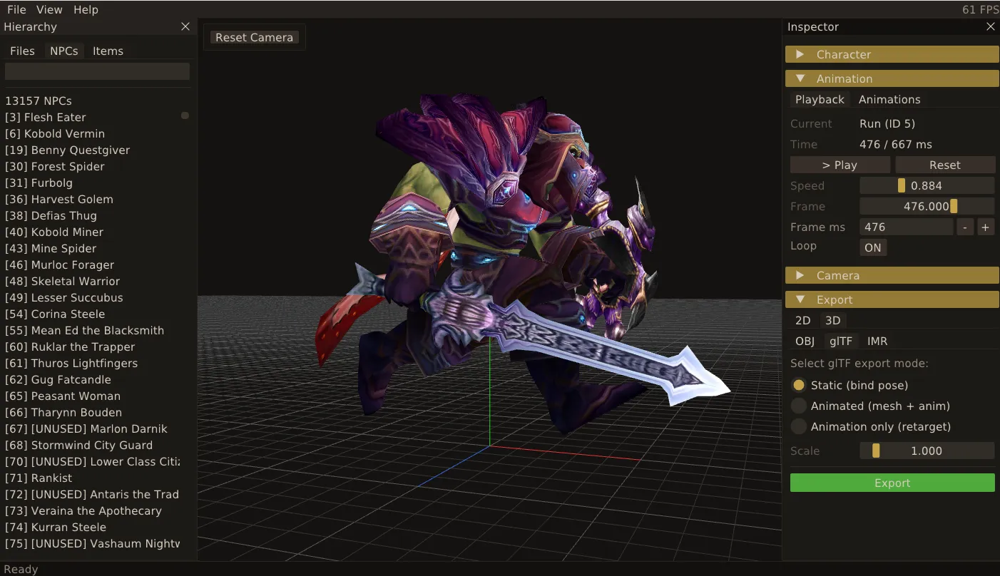

# Vanilla Studio

A WoW 1.12.1 (Vanilla) model viewer and exporter for Windows, Linux and macOS.

**Website:** https://rednibcoding.github.io/vanillastudio-website/

## Screenshots

  
  
  

## Support

If you find this useful, consider buying me a coffee:

